name: cover
class: cover

  

  
NUS RESEARCH SCHOLARSHIP NOMINATION INTERVIEW

  <h1>A Self Introduction</h1>
  
EducationResearch PortfolioResearch ProposalFuture Plans

  
Jiaying Li

  
Doctor of Philosophy in Architecture · January 2027 Intake

  

    
<b>College of Design &amp; Engineering</b> Department of Architecture

    
<b>Proposed Supervisor</b> · Dr Jinda Qi <b>Application No.</b> · R656527237

    
<b>18 August 2026</b> 1:00–1:30 pm Singapore Time · Online

  

???
Good afternoon, and thank you for the opportunity. I am Jiaying Li, currently completing the MRes in Urban Spatial Science at UCL CASA. I will introduce myself through four connected parts: my education, selected research outputs, the research I propose for the PhD, and my future plans.

[Sources]
Programme, application number, supervisor and interview details: applicant's NUS application and scholarship nomination email.
Official NUS Department of Architecture mark: https://cde.nus.edu.sg/arch/

---
name: profile
class: section-education

## Education | Biography

  

    

      

      
<b>Jiaying Li</b>MRes Urban Spatial Science

    

    

      
<label>AGE</label><b>24</b>

<label>HOMETOWN</label><b>Beijing</b>

      
<label>HOBBY</label><b>Hiking · Snowboarding</b>

<label>GRADUATION</label><b>September 2026</b>

    

    
The Bartlett Centre for Advanced Spatial Analysis (CASA) University College London (UCL)

    

      <a href="mailto:jiaying-li.25@ucl.ac.uk"><i class="fas fa-envelope" aria-hidden="true"></i>jiaying-li.25@ucl.ac.uk</a>
      <a href="https://github.com/JIAYING-ICE" target="_blank"><i class="fab fa-github" aria-hidden="true"></i>GitHub: JIAYING-ICE</a>
      <a href="https://www.ucl.ac.uk/bartlett/casa" target="_blank"><i class="fas fa-link" aria-hidden="true"></i>UCL CASA Site</a>
      <a href="https://jiaying-ice.github.io/Jiaying-portfolio/CASA_WORK/CV_Jiaying_LI.pdf" target="_blank"><i class="fas fa-file-pdf" aria-hidden="true"></i>View Academic CV (GitHub)</a>
    

    
<b>PhD Architecture · NUS CDE</b>Urban climate, spatial computation and built-environment performance<a href="https://cde.nus.edu.sg/arch/staffs/qi-jinda/" target="_blank">Proposed supervisor · Dr Jinda Qi ↗</a>

  

  

    

      
<button class="web-tab" type="button" data-panel="journey">ACADEMIC JOURNEY</button><button class="web-tab" type="button" data-panel="personality">PERSONALITY</button>

      

        

          

            
<button class="web-tab" type="button" data-panel="thu">THU</button><button class="web-tab" type="button" data-panel="bucea">BUCEA</button><button class="web-tab" type="button" data-panel="ucl">UCL CASA</button>

            

              

                
<b>Tsinghua University (THU)</b>School of Architecture · Beijing, China

                

<label>PROGRAMME</label>Joint Education Programme

<label>DURATION</label>Sep 2020 – Jul 2023

<label>ACADEMIC PERFORMANCE</label>GPA 3.67 / 4.0 · 9 of 11 architectural design courses awarded 4.0

<label>HONOURS &amp; SCHOLARSHIPS</label>Malan Flower Scholarship · Excellence Awards in Academics, Arts and Social Practice

              

              

                
<b>Beijing University of Civil Engineering and Architecture (BUCEA)</b>School of Architecture and Urban Planning

                

<label>DEGREE</label>Bachelor of Architecture (BArch)

<label>DURATION</label>Sep 2020 – Jul 2025

<label>ACADEMIC STANDING</label>GPA 3.85 / 4.0 · Rank 2 / 56

<label>MAJOR HONOUR</label>Outstanding Freshman Scholarship (2020 Cohort)

              

              

                
<b>University College London (UCL)</b>The Bartlett Centre for Advanced Spatial Analysis (CASA)

                

<label>DEGREE</label>MRes Urban Spatial Science

<label>DURATION</label>Sep 2025 – Sep 2026 · Ongoing

<label>RESEARCH FOCUS</label>Advanced Spatial Analysis &amp; Data Science · Geospatial Big Data · Remote Sensing

<label>SYSTEMS METHODS</label>Urban Simulation &amp; Systems Modelling

              

            

          

        

        

          
ADVENTURE SEEKER · ORIGINAL PORTFOLIO MAP

          <pre class="adventure-map">                  ┌──────────────────────JIAYING──────────────────────┐
                  ▼
[ Autonomous decision-making system ]                      [ Iterates &amp; Expands ]
                  ▲                                                   ▲
                  │                                                   │
            [ Certainty ]                                         Vitality
                  ▲                                                   ▲
                  │                                                   │
           “Deep Generalist”                                 [ Uncertainty ]
                  ▲                                                   ▲
                  │                         ┌─────────────────────────┼────────────────────────┐
         Systematic thinking           Growth mindset             Adaptability           Resilience
                  ▲                         ▲                         ▲                        ▲
        ┌─────────┴─────────┐               └─────────────────────────┼────────────────────────┘
    Intensity         Complexity                                      │
        ▲                   ▲               ┌─────────────────────────┼────────────────────────┐
        └─────────┬─────────┘          Curiosity driven          Risk driven           Meaning driven
                  │                         ▲                         ▲                        ▲
                  │                          └────────────────────────┼────────────────────────┘
             [ OBJECT ]                                               │
         (System Narrative)                                      [ SUBJECT ]
                  ▲                                            (Personal Dynamic)
                  │                                                   ▲
                  └──────────────────────────┬────────────────────────┘
                                    [ Adventure seeker ]</pre>
          
<b>Curiosity</b>Systematic thinkingAdaptabilityResilience

        

      

    

  

???
My education combines architecture and urban spatial science. Tsinghua and BUCEA trained me to work with spatial form, material systems, urban context and implementation. CASA made these questions measurable through geospatial data, remote sensing, spatial statistics and urban modelling. The personality map is retained from my portfolio because it describes how I work: curiosity defines the question, systematic thinking structures the evidence, and adaptability supports iteration under uncertainty.

[Sources]
Academic facts and research outputs: latest applicant CV, published at https://jiaying-ice.github.io/Jiaying-portfolio/CASA_WORK/CV_Jiaying_LI.pdf
Portrait and personal portfolio material: author-provided assets.
Dr Jinda Qi profile: https://cde.nus.edu.sg/arch/staffs/qi-jinda/

---
name: design
class: section-education

## Design as my starting point

<label>ARCHITECTURAL EDUCATION</label><b>Building · installation · urban design</b>

<label>INTERNSHIP &amp; BUILT WORK</label><b>On-site delivery · UABB Shenzhen</b>

  <a class="design-built" href="https://jiaying-ice.github.io/Jiaying-portfolio/CASA_WORK/Portfolio_Jiaying_LI.pdf#page=38" target="_blank">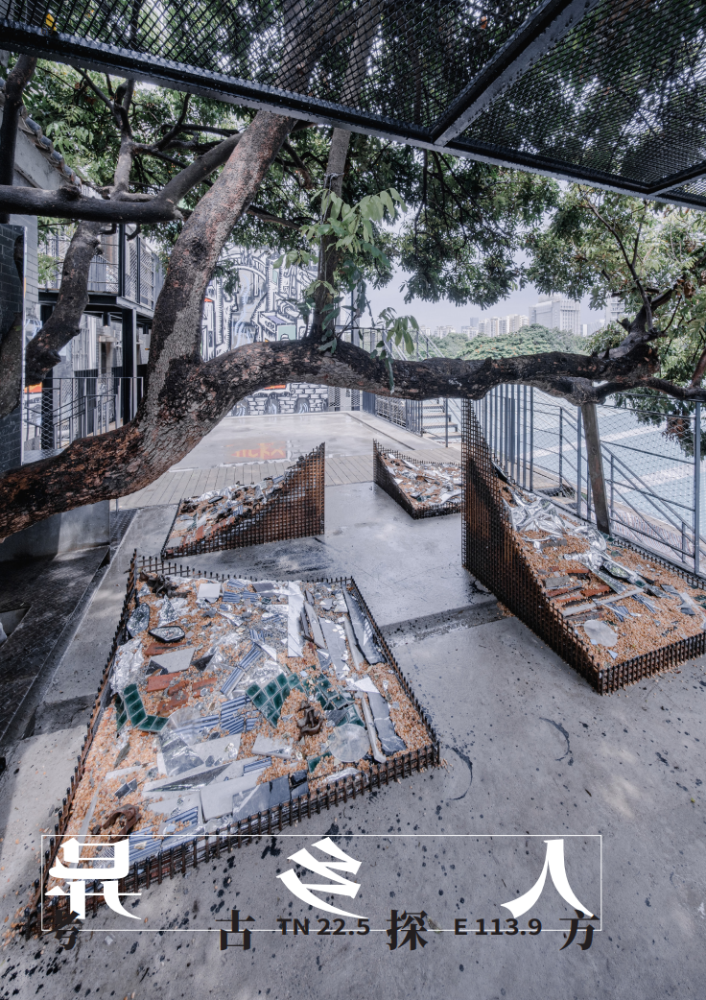
<b>Built work</b>Internship project · installation and on-site delivery · UABB Shenzhen
</a>
  

    <a href="https://jiaying-ice.github.io/Jiaying-portfolio/CASA_WORK/Portfolio_Jiaying_LI.pdf#page=4" target="_blank">Installation</a>
    <a href="https://jiaying-ice.github.io/Jiaying-portfolio/CASA_WORK/Portfolio_Jiaying_LI.pdf#page=11" target="_blank">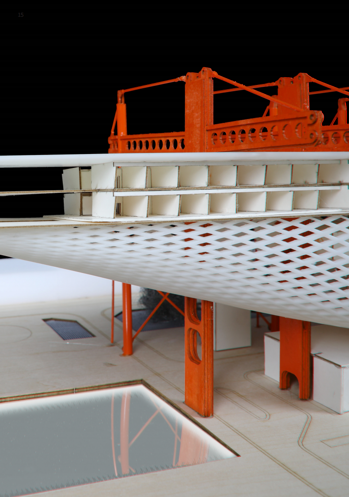Structure</a>
    <a href="https://jiaying-ice.github.io/Jiaying-portfolio/CASA_WORK/Portfolio_Jiaying_LI.pdf#page=22" target="_blank">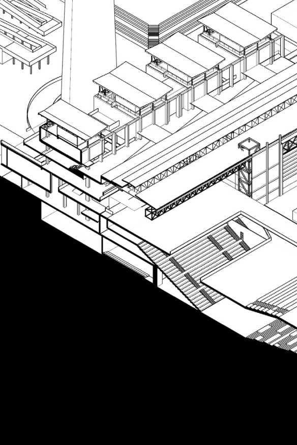Urban design</a>
    <a href="https://jiaying-ice.github.io/Jiaying-portfolio/CASA_WORK/Portfolio_Jiaying_LI.pdf#page=30" target="_blank">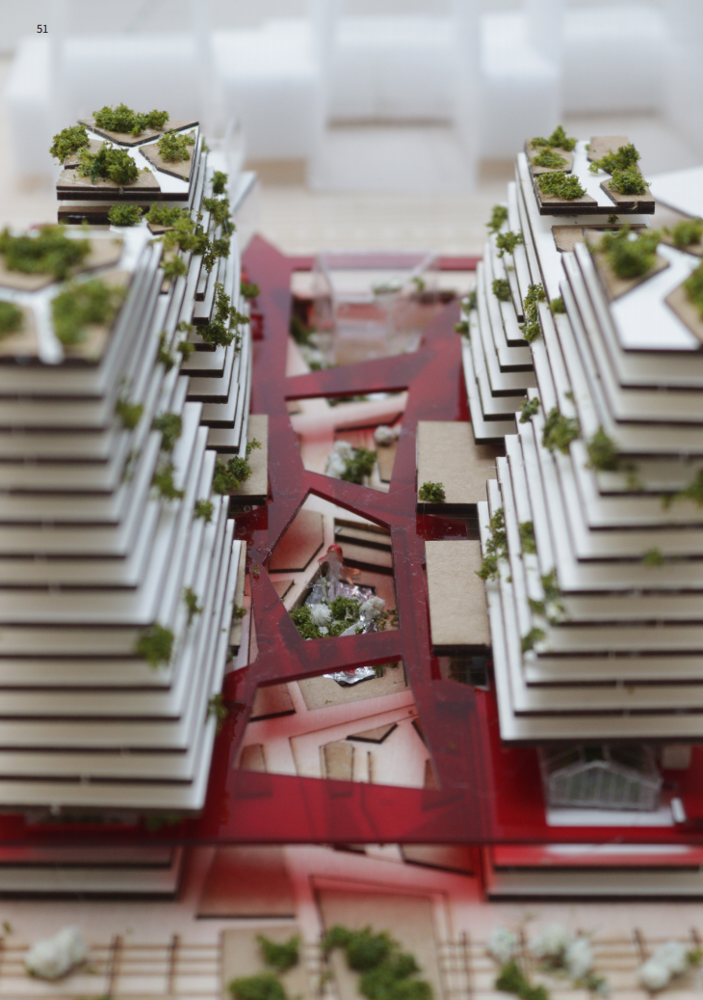Architecture</a>
  

<b>SPATIAL FORM</b>+<b>ENVIRONMENTAL PERFORMANCE</b>+<b>IMPLEMENTATION</b>

???
Design was my starting point. It trained me to move between the scale of a component, a building and an urban system while keeping implementation in view. During an internship, one project was constructed and exhibited at the ninth Bi-City Biennale of Urbanism and Architecture in Shenzhen. This experience still shapes how I approach research: evidence should eventually inform something that can be designed, operated or changed.

[Sources]
Portfolio images and linked portfolio PDF: author-provided portfolio repository, https://github.com/JIAYING-ICE/Jiaying-portfolio
Course and studio results: latest applicant CV.

---
name: toolkit
class: section-education

## CASA | Research Toolkit

  
<button class="web-tab" type="button" data-panel="capability">CAPABILITY MAP</button><button class="web-tab" type="button" data-panel="matrix">TOOLKITS</button><button class="web-tab" type="button" data-panel="coursework">COURSEWORK</button>

  

    

      

        

          <svg class="neuron-links" viewBox="0 0 100 100" preserveAspectRatio="none" aria-hidden="true">
            <g class="branch-links branch-geo">
              <path class="neuron-trunk" d="M50 50 C42 47 34 38 27 31"/>
              <path d="M27 31 C20 24 15 18 11 15 M27 31 C20 38 15 45 11 51"/>
              <path d="M11 15 L2 7 M11 15 L13 6 M11 15 L2 20 M11 15 L4 31 M11 51 L2 43 M11 51 L4 59"/>
            </g>
            <g class="branch-links branch-spatial">
              <path class="neuron-trunk" d="M50 50 C58 47 66 38 73 31"/>
              <path d="M73 31 C81 22 86 17 89 13 M73 31 C81 31 86 32 90 33 M73 31 C80 40 84 48 88 53"/>
              <path d="M89 13 L91 4 M89 13 L98 8 M90 33 L98 20 M90 33 L99 28 M90 33 L99 38 M90 33 L96 45 M88 53 L98 51 M88 53 L99 60 M88 53 L96 69 M88 53 L99 76"/>
            </g>
            <g class="branch-links branch-simulation">
              <path class="neuron-trunk" d="M50 50 C50 57 50 63 50 69"/>
              <path d="M50 69 C39 73 30 78 22 83 M50 69 C50 76 50 82 50 86 M50 69 C61 73 70 78 78 83"/>
              <path d="M22 83 L8 77 M22 83 L6 87 M22 83 L13 95 M22 83 L27 95 M50 86 L41 96 M50 86 L50 96 M50 86 L59 96 M78 83 L73 95 M78 83 L91 88"/>
            </g>
          </svg>
          
CASA<b>RESEARCH TOOLKIT</b>

          <button class="toolkit-primary node-geo is-selected" type="button" data-toolkit="geo">OBSERVE<b>Geospatial Big Data</b></button>
          <button class="toolkit-primary node-spatial" type="button" data-toolkit="spatial">MEASURE<b>Advanced Spatial Data Science</b></button>
          <button class="toolkit-primary node-sim" type="button" data-toolkit="simulation">TEST<b>Urban Simulation &amp; Systems</b></button>

          GIS &amp; Science
          Remote Sensing
          Quant Methods
          Foundations of SDS
          DS for Spatial Systems
          Urban Systems Theory
          Agent-based Modelling
          Urban Simulation

          
          
          
          
          
          

          
          
          
          
          
          
          
          
          
          

          
          
          
          
          
          
          
          
          
          36 CONNECTED CAPABILITIES · SELECT A PRIMARY BRANCH
        

        

OBSERVE
<b class="toolkit-detail-title">Observe urban conditions across scales and time</b>
Earth observation, LiDAR, GIS and three-dimensional urban data resolve buildings, infrastructure and environmental change.

<b>HOW</b>Remote sensing · GIScience · LiDAR · OpenStreetMap · Google Earth Engine
<button class="node-drawer-toggle" type="button">VIEW ALL 36 NODES</button>

      

      

        
<b>CASA Tech Neuron · 36 connected nodes</b><button class="node-drawer-close" type="button">CLOSE</button>

        

          <section class="neuron-branch">
MEASURE
<b class="level-1">Advanced Spatial Data Science</b>
<b>Quant Methods</b>RStatistics

<b>Foundations of SDS</b>PythonSQLGitHubDocker

<b>DS for Spatial Systems</b>MLCNNANNAlgorithms
</section>
          <section class="neuron-branch">
OBSERVE
<b class="level-1">Geospatial Big Data</b>
<b>GIS &amp; Science</b>GISRStudioR MarkdownOpenStreetMap

<b>Remote Sensing</b>Earth ObservationGoogle Earth Engine
</section>
          <section class="neuron-branch">
TEST
<b class="level-1">Urban Simulation &amp; Systems</b>
<b>Urban Systems Theory</b>Causal DiagramsSystem DynamicsScaling LawsComplexity

<b>Agent-based Modelling</b>NetLogoABM–GISOptimisation

<b>Urban Simulation</b>Network ModellingFlow Simulation
</section>
        

      

    

    

      <table class="evidence-matrix toolkit-table"><thead><tr><th>RESEARCH TASK</th><th>WHAT</th><th>HOW</th></tr></thead><tbody>
        <tr><td><b>Observe conditions</b></td><td>Buildings, infrastructure and environmental change across scales and time</td><td>GIS · EO · LiDAR · 3D urban data</td></tr>
        <tr><td><b>Measure patterns</b></td><td>Spatial variation, recurrence, uncertainty and scale sensitivity</td><td>Spatial statistics · hierarchical models · sensitivity analysis</td></tr>
        <tr><td><b>Explain mechanisms</b></td><td>Candidate processes and bounded interpretations</td><td>Causal diagrams · interpretable ML · process models</td></tr>
        <tr><td><b>Evaluate interventions</b></td><td>Design and operational alternatives under explicit objectives</td><td>Parametric modelling · EnergyPlus · LCA · multi-criteria analysis</td></tr>
        <tr><td><b>Reproduce evidence</b></td><td>Traceable data transformations, figures and robustness checks</td><td>R · Python · SQL · Git · versioned workflows</td></tr>
      </tbody></table>
      
<b>A spatial evidence programme for built-environment performance</b>BUILT ENVIRONMENTENVIRONMENTAL SUSTAINABILITYURBAN HEALTHENERGY TRANSITIONCLIMATE RESILIENCE

    

    

      <a href="https://jiaying-ice.github.io/Jiaying-portfolio/CASA_WORK/UrbanSystemsTheory_CausalModel.pdf" target="_blank"><b>CASA0001 · Urban Systems Theory</b>Auto-dependency causal model · View PDF ↗</a>
      <a href="https://jiaying-ice.github.io/Jiaying-portfolio/CASA_WORK/GeographicInformationSystemsScience_Final%20exam.pdf" target="_blank"><b>CASA0005 · GIScience</b>Spatial analysis final exam · View PDF ↗</a>
      <a href="https://jiaying-ice.github.io/Jiaying-portfolio/CASA_WORK/DataScienceForSpatialSystems_LondonRoadSafety.pdf" target="_blank"><b>CASA0006 · Data Science</b>Road collision severity · View PDF ↗</a>
      <a href="https://jiaying-ice.github.io/Jiaying-portfolio/CASA_WORK/QuantitativeMethods_Drone_Supply%20_Demand.pdf" target="_blank"><b>CASA0007 · Quantitative Methods</b>Drone supply–demand study · View PDF ↗</a>
      <a href="https://jiaying-ice.github.io/Jiaying-portfolio/CASA_WORK/FoundationsOfSpatialDataScience%20_GroupWork.pdf" target="_blank"><b>CASA0013 · Foundations of SDS</b>Group research report · View PDF ↗</a>
      <a href="https://jiaying-ice.github.io/Jiaying-portfolio/CASA_WORK/CASA0023_Learning_Diary/index.html" target="_blank"><b>CASA0023 · Remote Sensing</b>Interactive learning diary · View site ↗</a>
    

<b>OBSERVE → MEASURE → EXPLAIN → EVALUATE → REPRODUCE</b>

  

???
CASA extended my design training into a research toolkit. I use geospatial data to observe conditions, spatial analysis to measure patterns and uncertainty, and simulation to test explanations or alternatives. Together, these capabilities support research on built-environment performance across sustainability, health, energy transition and climate resilience. The full thirty-six-node map and six inspected coursework outputs remain available through the interactive tabs.

[Sources]
CASA curriculum and coursework: author-provided course materials and portfolio repository.
Thirty-six-node taxonomy adapted from the author's original CASA Tech Neuron in Jiaying-2026 portfolio.Rmd.

---
name: portfolio
class: section-portfolio

## Research Portfolio | Selected Work

  <a class="research-card" href="#bipv">
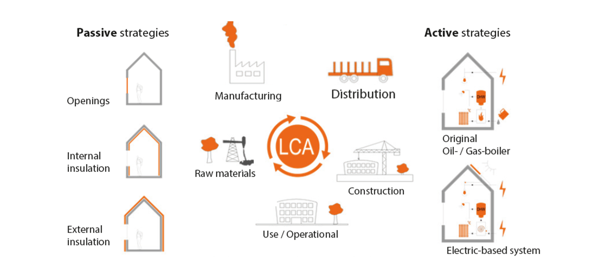

MANUSCRIPT UNDER REVIEW
<b>Community-scale BIPV renovation</b>Energy · carbon · economics · architectural integration<small>Equal first author</small></a>
  <a class="research-card" href="#cpc">
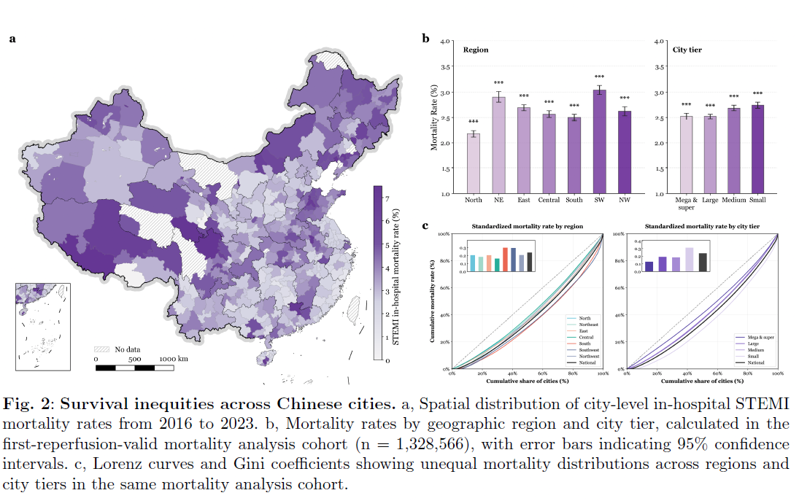

MANUSCRIPT UNDER REVIEW
<b>Urban cardiac emergency survival</b>Infrastructure · operations · spatial health equity<small>Second author</small></a>
  <a class="research-card" href="#mres">

MANUSCRIPT IN PREPARATION
<b>Rooftop solar deployment–opportunity alignment</b>LiDAR · remote sensing · temporal identification<small>First author</small></a>
  <a class="research-card next" href="#research-direction">
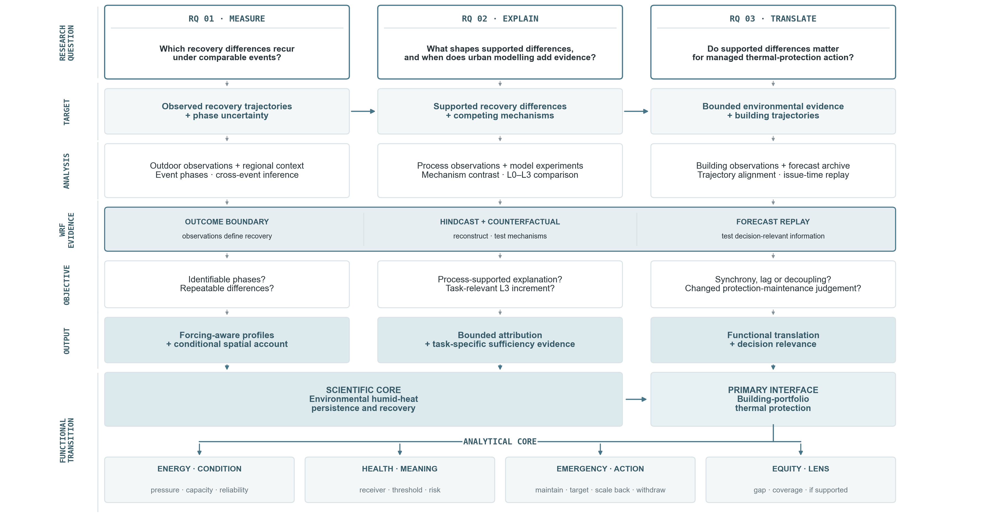

NEXT RESEARCH
<b>Urban humid-heat persistence and recovery</b>Mechanisms · model sufficiency · building significance<small>PhD research proposal</small></a>

ENVIRONMENTAL SUSTAINABILITYURBAN HEALTHENERGY TRANSITIONCLIMATE RESILIENCE

???
My research portfolio contains three substantive projects and the proposed next research programme. The first examines policy choices in community BIPV renovation. The second examines how infrastructure and operations shape cardiac emergency survival across cities. The third measures rooftop solar deployment against building-level opportunity through temporal identification. I will introduce each project through the same structure: problem, evidence, result, my role and the TAKE AWAY that carries into the PhD.

[Sources]
BIPV, CPC and MRes figures: author-provided manuscripts, dissertation and original figure files.
Proposal thumbnail: author-provided verified PhD proposal figure.

---
name: bipv
class: section-portfolio research-detail

## Community-scale BIPV | Policy priorities produce different optima

<b>79</b>residential units

<b>15</b>configurations

<b>3</b>policy-conditional optima

<b>73.6–115.0%</b>solar self-sufficiency

  

    
<button class="web-tab" type="button" data-panel="optima">OPTIMA</button><button class="web-tab" type="button" data-panel="frontier">FRONTIER</button><button class="web-tab" type="button" data-panel="workflow">WORKFLOW</button><button class="web-tab" type="button" data-panel="configurations">CONFIGURATIONS</button><button class="web-tab" type="button" data-panel="portfolio-matrix">PORTFOLIO MATRIX</button>

    

      
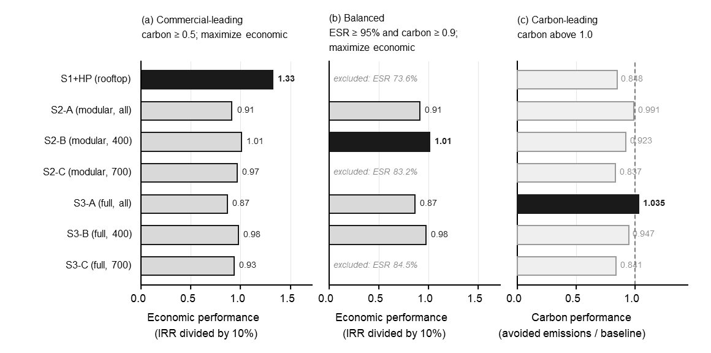Three policy criteria select three different configurations.

      
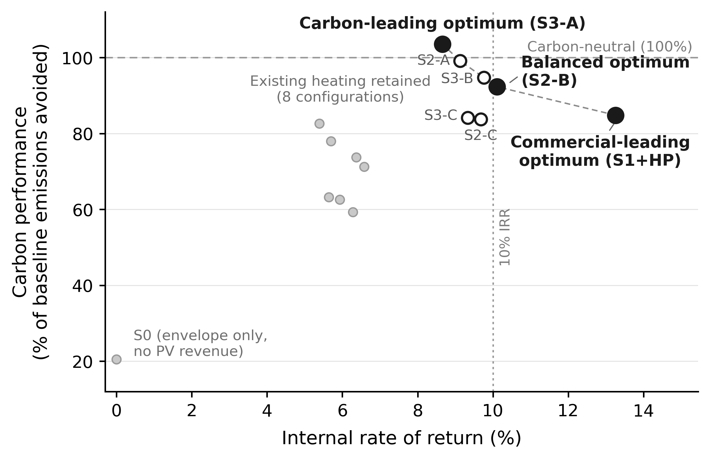Carbon and economic performance across fifteen configurations.

      
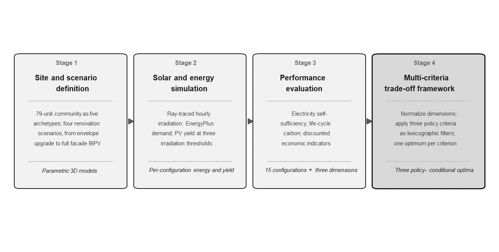Simulation, lifecycle evaluation and decision comparison.

      
Envelope improvement, rooftop pavilion and façade deployment.

      
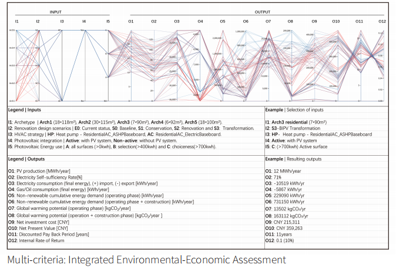Earlier portfolio view of the multi-criteria evidence.

    

  

  

    
<label>ARTICLE TITLE</label><b>Mapping the Trade-Off Frontier of Community-Scale Building-Integrated Photovoltaic (BIPV) Renovation</b>Multi-Criteria Evaluation Reveals Three Policy-Conditional Optima<em>ENERGY TRANSITION · ENVIRONMENTAL SUSTAINABILITY</em>

    
<label>PROBLEM</label>
How should a community choose a BIPV renovation when energy, carbon and financial priorities favour different designs?

    
<label>EVIDENCE</label>
79 units · 15 configurations · ray-traced solar analysis · EnergyPlus · lifecycle carbon and financial evaluation

    
<label>RESULT</label>
Commercial, balanced and carbon-leading priorities selected three different optima; payback ranged from <b>8.01</b> to <b>11.71 years</b>.

    
<label>MY ROLE</label>
<b>Equal first author</b> · research design · parametric modelling · simulation · multi-criteria analysis · manuscript development

    
<label>TAKE AWAY</label>
Transparent decision criteria convert technical performance into different policy choices.

  

Under review · <i>Energy for Sustainable Development</i> · Equal first author

???
Community-scale BIPV renovation presents a decision problem: energy, carbon and financial priorities can favour different designs. For a seventy-nine-unit community, we compared fifteen configurations using ray-traced solar analysis, EnergyPlus, lifecycle carbon and financial evaluation. The result was three policy-conditional optima—commercial, balanced and carbon-leading—rather than one imposed ranking. As equal first author, I led the integrated spatial, energy and multi-criteria analysis. The TAKE AWAY was that transparent criteria turn technical performance into a policy-relevant choice.

[Sources]
Source manuscript: Mapping the Trade-Off Frontier of Community-Scale Building-Integrated Photovoltaic Renovation: Multi-Criteria Evaluation Reveals Three Policy-Conditional Optima.
Figures 1, 5, 12 and 17: original embedded media from the author-provided 20260707_manuscript.docx.
Portfolio matrix: author-provided portfolio asset.

---
name: cpc
class: section-portfolio research-detail

## Urban cardiac emergency | Visible infrastructure and operational performance can diverge

<b>1.821M</b>STEMI records

<b>4,259</b>centres

<b>350</b>cities

<b>2016–23</b>study period

  

    
<button class="web-tab" type="button" data-panel="viof">VIOF</button><button class="web-tab" type="button" data-panel="infrastructure">INFRASTRUCTURE</button><button class="web-tab" type="button" data-panel="operations">OPERATIONS</button><button class="web-tab" type="button" data-panel="decoupling">DECOUPLING</button><button class="web-tab" type="button" data-panel="inequities">INEQUITIES</button><button class="web-tab" type="button" data-panel="prediction">PREDICTION</button>

    

      
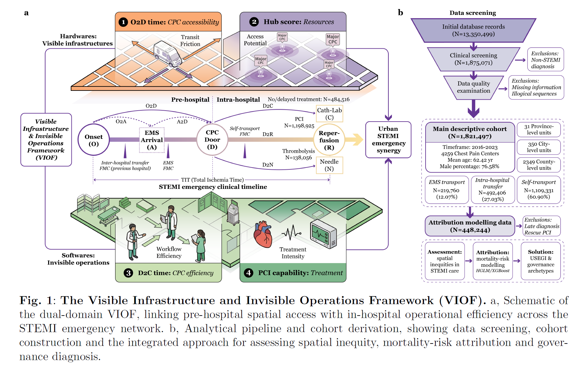VIOF separates spatial access, operational execution and survival outcomes.

      
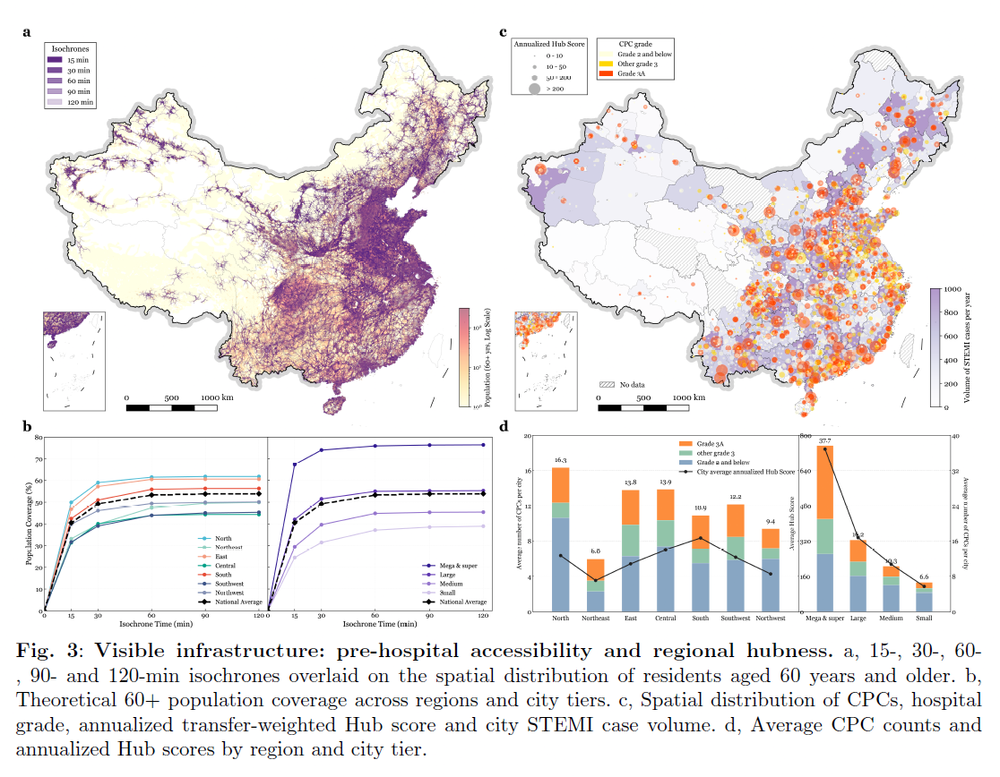Accessibility and regional hubness describe the visible system.

      
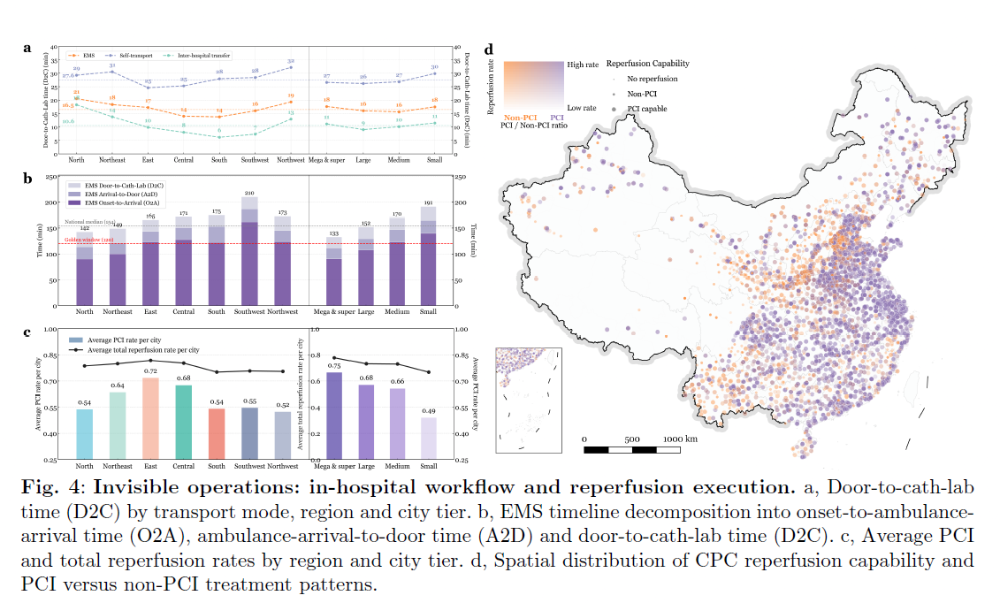Workflow execution describes the operational system.

      
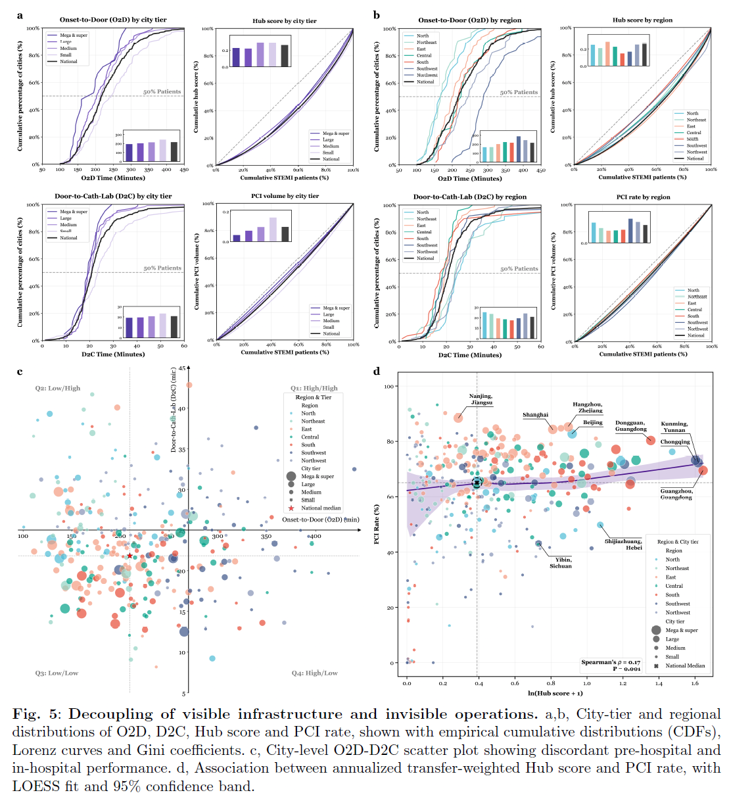Pre-hospital and in-hospital performance define distinct system conditions.

      
City-level survival outcomes reveal system inequities.

      
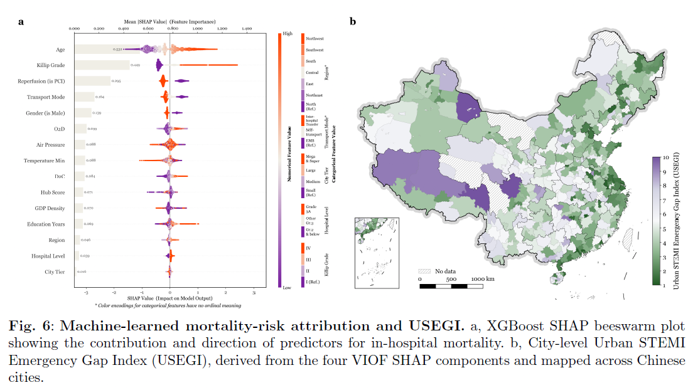SHAP-based predictive contribution by evidence domain.

    

  

  

    
<label>ARTICLE TITLE</label><b>Urban cardiac emergency survival inequities from seen infrastructure and unseen operations</b><em>URBAN HEALTH · BUILT-ENVIRONMENT SYSTEMS</em>

    
<label>PROBLEM</label>
Why do cities with visible emergency-care capacity achieve different survival performance?

    
<label>EVIDENCE</label>
1.821M STEMI records · 4,259 centres · 350 cities · accessibility · hierarchical modelling · XGBoost and SHAP

    
<label>RESULT</label>
Pre-hospital and in-hospital performance diverged in <b>190 of 350 cities</b>; operational variables represented <b>69.0%</b> of SHAP-based predictive contribution.

    
<label>MY ROLE</label>
<b>Second author</b> · data curation · spatial and statistical analysis · interpretable modelling

    
<label>TAKE AWAY</label>
Separating infrastructure from operations reveals distinct governance priorities.

  

Under review · <i>Nature Cities</i> · Second author 

???
The cardiac-emergency study asked how visible infrastructure aligns with operational performance across cities. The evidence covered one point eight two one million STEMI records, four thousand two hundred and fifty-nine centres and three hundred and fifty cities. Pre-hospital and in-hospital performance diverged in one hundred and ninety cities, and operational variables accounted for sixty-nine percent of the fitted model's SHAP-based predictive contribution—a predictive rather than causal interpretation. As second author, I contributed data curation, spatial and statistical analysis, and interpretable modelling. The TAKE AWAY was that separating infrastructure from operations reveals distinct governance priorities.

[Sources]
Source manuscript: Urban cardiac emergency survival inequities from seen infrastructure and unseen operations.
Figures: author-replaced high-resolution screenshots in the interview image package.
Authorship: applicant-confirmed role, Second author.

---
name: mres
class: section-portfolio research-detail

## Measuring Rooftop Solar Deployment–Opportunity Alignment

A Building-Level Spatial Analysis with Temporal Identification in Washington, DC

<b>160,959</b>citywide buildings

<b>18.88%</b>conditioned model-indicated PV rate

<b>3,540</b>comparability-controlled records

<b>874</b>provisional candidates

  

    
<button class="web-tab" type="button" data-panel="citywide">CITYWIDE</button><button class="web-tab" type="button" data-panel="alignment">ALIGNMENT</button><button class="web-tab" type="button" data-panel="architecture">EVIDENCE</button><button class="web-tab" type="button" data-panel="pipeline">MEASUREMENT</button><button class="web-tab" type="button" data-panel="temporal">TEMPORAL</button><button class="web-tab" type="button" data-panel="longitudinal">LONGITUDINAL</button>

    

      
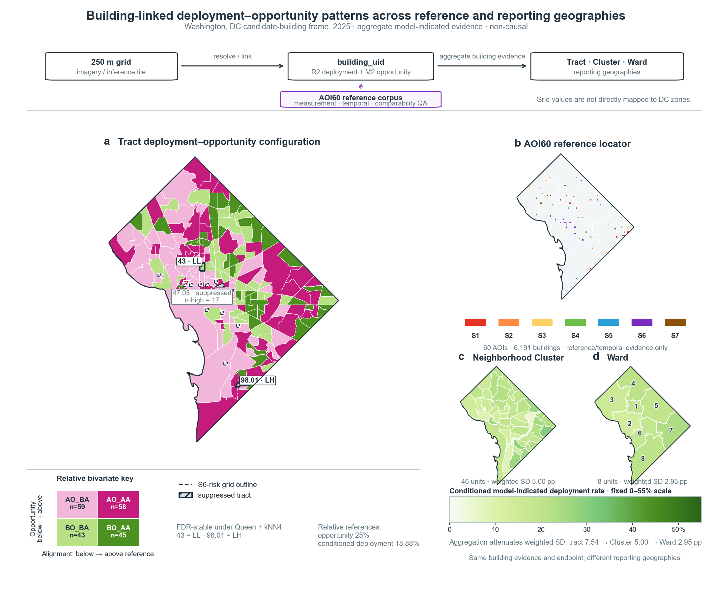Final dissertation Fig. 4.2 · citywide and multi-scale spatial synthesis.

      
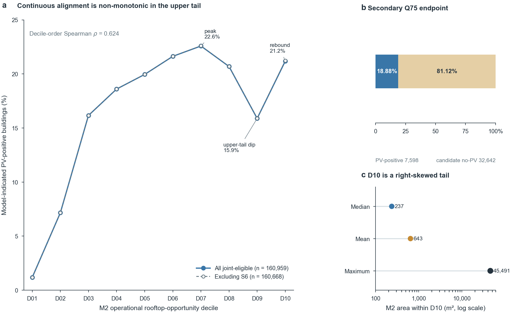Final dissertation Fig. 4.1 · deployment across opportunity deciles.

      
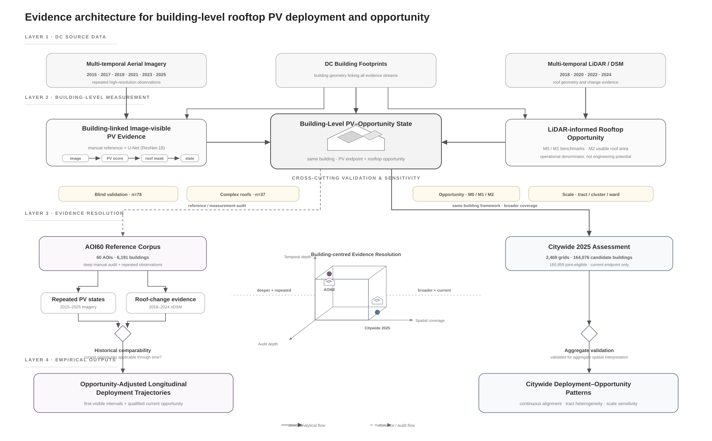Final dissertation Fig. 1.1 · independent evidence streams linked at building level.

      
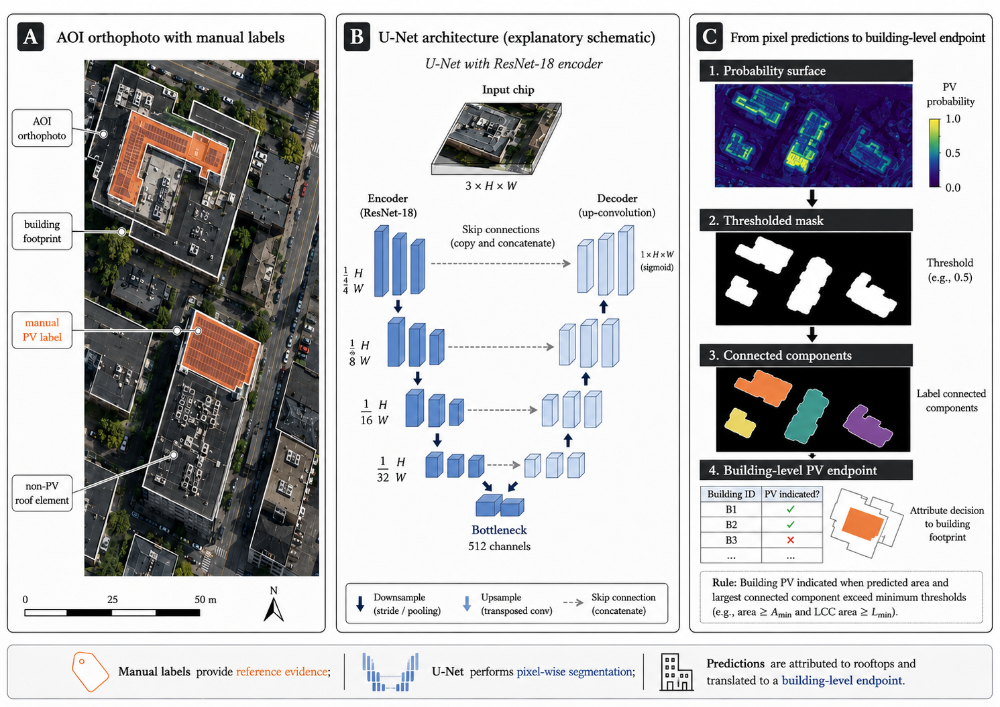Final dissertation Fig. 3.2 · reference interpretation, U-Net and building endpoint.

      
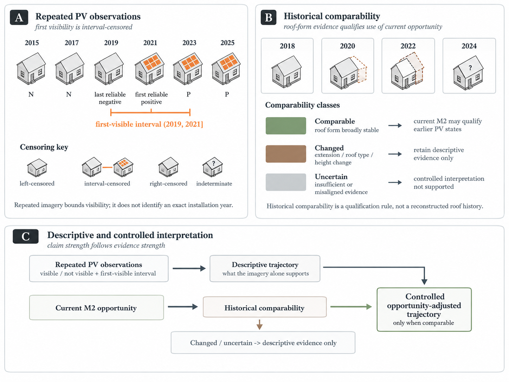Final dissertation Fig. 3.3 · first-visible timing, censoring and comparability.

      
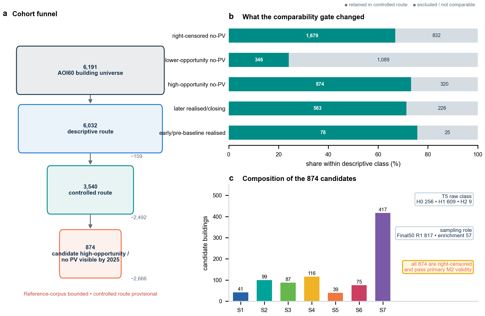Final dissertation Fig. 4.3 · controlled temporal corpus and provisional candidates.

    

  

  

    
<label>DISSERTATION TITLE</label><b>Measuring Rooftop Solar Deployment–Opportunity Alignment</b>A Building-Level Spatial Analysis with Temporal Identification in Washington, DC<em>ENERGY TRANSITION · SPATIAL SUSTAINABILITY</em>

    
<label>PROBLEM</label>
Does rooftop PV deployment align with building-level opportunity once reporting scale and timing are controlled?

    
<label>EVIDENCE</label>
U-Net-derived PV evidence · official footprints · 2024 LiDAR opportunity · 2015–2025 imagery · multi-scale sensitivity analysis

    
<label>RESULT</label>
Within <b>40,240</b> upper-quartile buildings, <b>7,598</b> were model-indicated PV-positive; temporal screening retained <b>3,540</b> comparable records, including <b>874</b> provisional candidates.

    
<label>MY ROLE</label>
<b>First author</b> · study design · data engineering · modelling · validation · sensitivity analysis · interpretation

    
<label>TAKE AWAY</label>
Denominator, spatial scale and temporal comparability can shape the conclusion as strongly as the detection model.

  

MRes dissertation · Manuscript in preparation · First author

???
My MRes addressed a measurement problem: deployment maps show where PV is visible, while planning requires comparison with building-level opportunity over time. I integrated repeated imagery, official footprints and LiDAR across one hundred and sixty thousand nine hundred and fifty-nine buildings. Among forty thousand two hundred and forty buildings in the upper opportunity quartile, seven thousand five hundred and ninety-eight had model-indicated PV. The controlled temporal subset retained three thousand five hundred and forty records, including eight hundred and seventy-four high-opportunity buildings with no PV observed by 2025. I independently owned the full workflow from question definition to sensitivity analysis. The TAKE AWAY was that denominator, scale and temporal evidence can shape the conclusion as strongly as the detection model.

[Sources]
Source dissertation: Measuring Rooftop Solar Deployment–Opportunity Alignment: A Building-Level Spatial Analysis with Temporal Identification in Washington, DC.
Figures: final dissertation figures 1.1, 3.2, 3.3, 4.1, 4.2 and 4.3 from the author-controlled final figure package.

---
name: research-direction
class: section-proposal

## Research Direction | Spatial evidence for environmental performance

Environmental sustainabilityUrban healthEnergy transitionClimate resilience

  
<label>RESEARCHED SYSTEMS</label>
<b>Buildings and energy</b>BIPV renovation and rooftop solar deployment

<b>Urban health infrastructure</b>Emergency accessibility, operations and survival

  
MEASUREEXPLAINEVALUATE

  
<label>PHD RESEARCH OBJECT</label>
<b>Urban humid-heat recovery</b>Regional atmosphere · local urban conditions · building thermal protection

<b>Research purpose</b>Produce evidence that connects recovery processes with model sufficiency and built-environment decisions.

My research connects physical and technical conditions with observed performance, explanations and practical decisions.
<button class="structure-drawer-toggle" type="button">VIEW STRUCTURE</button>

  
<b>Research Interest · Evolution from design intuition to environmental decision research</b><button class="structure-drawer-close" type="button">CLOSE</button>

  <pre class="research-interest-map">      [ S C O P E ]                             [ M E T H O D O L O G Y ]                   [ P H I L O S O P H Y ]
         ┌──────────────────────────────────────────────────┼──────────────────────────────────────────────────┐
Environmental Sustainability                        Decision Automation                                 Synthesis
         └──────────────────────────────────────────────────┼──────────────────────────────────────────────────┘
                                                            ▲
                                                            │
                    ┌───────────────────────────────────────┼───────────────────────────────────────┐
             Urban Analysis                            Data driven                         Silicon-based life
                    └───────────────────────────────────────┼───────────────────────────────────────┘
                                                            ▲
                                                            │
                              ┌─────────────────────────────┼─────────────────────────────┐
                       Architectural Design           Instinct driven               Carbon-based life
                              └─────────────────────────────┼─────────────────────────────┘
                                                            ▲
                                                            │
                                                       THE ORIGIN</pre>

???
These projects define my broader research direction. I am interested in environmental sustainability, urban health, energy transition and climate resilience as connected built-environment questions. Across buildings, infrastructure and cities, I measure spatial performance, examine the processes associated with recurring differences, and evaluate how the evidence can support a decision. The proposed PhD extends this direction to urban humid-heat recovery across the atmosphere, neighbourhoods and buildings.

[Sources]
Research direction synthesised from the applicant's completed projects, latest CV and verified PhD proposal.

---
name: motivation
class: section-proposal

## Research Motivation | Humid-heat recovery unfolds across connected scales

<b>Urban Humid-Heat Persistence and Recovery in Singapore</b> · Mechanisms, Model Sufficiency and Functional Significance

  
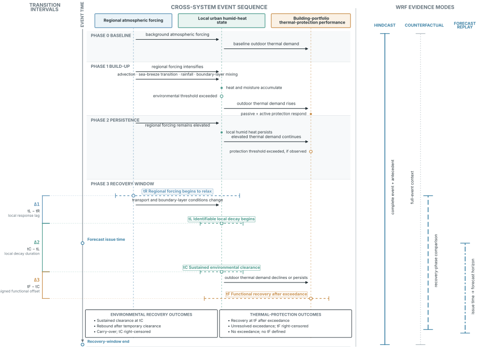

  

<label>STARTING QUESTION</label><b>What happens after the regional weather appears to improve?</b>

<b>Regional forcing</b>Defines the shared meteorological event and the onset of regional relaxation.

<b>Local humid heat</b>Measures neighbourhood decay, sustained clearance, rebound and carry-over.

<b>Building protection</b>Evaluates indoor thermal protection, lag and functional recovery.

<label>RESEARCH FOCUS</label>Which differences recur, which processes explain them, and what evidence is useful for building and operational decisions?

Conceptual event clock · timing relationships are categorical.

???
The proposal begins with a simple question: What happens after the regional weather appears to improve? In Singapore, regional forcing may relax while some neighbourhoods remain warm and humid, and buildings may recover later. I place three transitions on one event clock: regional relaxation, local decline and sustained clearance, and building thermal-protection recovery. The figure defines comparable timings without pre-judging the result. Singapore is a strong test case because humidity, coastal circulation, dense morphology and managed cooling interact within one compact city.

[Sources]
Verified PhD proposal: Urban Humid-Heat Persistence and Recovery in Singapore: Mechanisms, Model Sufficiency and Functional Significance.
Figure: original SVG, Figure 2 event-time framework, author-provided final submission package.

---
name: research-questions
class: section-proposal

## Research Questions

  

RQ1 · MEASURE
<b>Recurring spatial recovery</b>
Which local recovery differences recur across events after accounting for event conditions?
Outcome: forcing-aware recovery measures and recurrent spatial patterns

  
→

  

RQ2 · EXPLAIN
<b>Processes and model sufficiency</b>
Which atmospheric and urban processes are consistent with recurrent differences, and when does WRF-Urban add evidence?
Outcome: targeted process tests and comparative model evidence

  
→

  

RQ3 · RELATE
<b>Building thermal significance</b>
When do outdoor recovery differences translate into lagged or decoupled building thermal protection, and what does this imply for building operation or heat-response timing?
Outcome: outdoor–building recovery relationships with operational meaning

<b>Common event clock</b>Comparable timing across regional, local and building scales

<b>Independent observations</b>Outcome definition before targeted model experiments

<b>Comparative evidence</b>Model complexity evaluated by the information it adds

???
The research is organised through three questions. First, which local recovery differences recur across events after accounting for event conditions? Second, which atmospheric and urban processes are consistent with those recurring differences, and when does WRF-Urban add useful evidence? Third, when do outdoor recovery differences translate into lagged or decoupled building thermal protection? The sequence moves from measurement, to explanation, to functional significance, with independent observations defining the recovery outcomes.

[Sources]
Research questions and outcome definitions: author-provided verified PhD proposal.
---
name: research-design
class: section-proposal

## Research Design | Observations define recovery; models test explanations

Atmospheric observationsUrban surface &amp; formWRF / WRF-UrbanBuilding performanceForecast records

  
<button class="web-tab" type="button" data-panel="logic">STUDY LOGIC</button><button class="web-tab" type="button" data-panel="data">DATA SOURCES</button><button class="web-tab" type="button" data-panel="evaluation">EVALUATION</button>

  

    

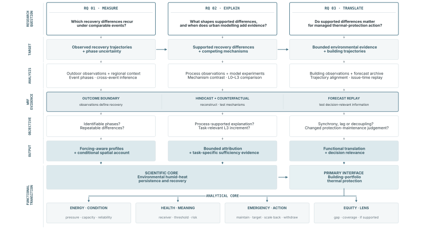

<b>1 · Define events</b>Establish forcing-aware event and recovery measures.

<b>2 · Measure recurrence</b>Identify local differences that recur across events.

<b>3 · Test explanations</b>Use observations and targeted model experiments.

<b>4 · Evaluate significance</b>Relate outdoor recovery to buildings, forecasts and decisions.

    
<table class="data-table"><thead><tr><th>Evidence domain</th><th>Proposed sources</th><th>Key variables</th><th>Analytical role</th><th>Acquisition route</th></tr></thead><tbody>
      <tr><td><b>Atmospheric conditions</b></td><td>MSS / NEA observations; ERA5</td><td>Temperature, humidity, wind, radiation, rainfall</td><td>Event definition and forcing controls</td><td>Official archive or request; public reanalysis</td></tr>
      <tr><td><b>Urban surface and form</b></td><td>Landsat, Sentinel, ECOSTRESS; OneMap, OSM, WUDAPT; 3D / LiDAR</td><td>Surface temperature, land cover, morphology, roughness, shading</td><td>Local context and urban representation</td><td>Public, derived and licensed sources</td></tr>
      <tr><td><b>Atmospheric modelling</b></td><td>WRF and WRF-Urban inputs and urban parameters</td><td>Three-dimensional atmosphere; energy and moisture fluxes</td><td>Event reconstruction and targeted process experiments</td><td>Reproducible modelling workflow</td></tr>
      <tr><td><b>Building performance</b></td><td>Indoor T / RH; BMS, HVAC, energy, occupancy and action records</td><td>Thermal protection, lag and functional recovery</td><td>Outdoor–building recovery analysis</td><td>Collaboration and relevant approvals</td></tr>
      <tr><td><b>Forecast and decision records</b></td><td>Historical issue-time forecasts, warnings and action records</td><td>Lead time, thresholds and action changes</td><td>Forecast replay and decision relevance</td><td>Archive access and partner agreement</td></tr>
    </tbody></table>

    

<b>Weather skill</b>Bias, MAE / RMSE, extremes, onset, duration and recovery timing

<b>Urban information skill</b>Place ranking, threshold timing, sustained clearance, rebound and uncertainty

<b>Functional and decision relevance</b>Building protection, lead time, action timing and robustness

<b>Task-matched model comparison</b>
Operational productsData-driven localisationWRFWRF-UrbanMorphology-aware refinement
<small>Common events · issue times · validation records · information tasks · cost accounting</small>

  

???
The design begins with observations. Atmospheric data define events and recovery outcomes, urban surface and form data describe local context, and building records provide the functional interface where access and approvals permit. Targeted WRF and WRF-Urban experiments then test process explanations. Historical forecast records support a later replay analysis. The comparison evaluates weather skill, urban information skill, and functional or decision relevance. Each data source therefore has a specific analytical role, and partnership-dependent data are identified explicitly.

[Sources]
Research framework and planned data architecture: author-provided verified PhD proposal.
Figure: original SVG, Figure 1 research framework, author-provided final submission package.
Data access wording reflects proposed acquisition routes; collaboration-dependent records are presented as planned sources.
---
name: contributions
class: section-proposal

## Expected Contributions and Research Outputs

  
<label>RESEARCH VISION</label><b>Move beyond peak heat to understand when neighbourhoods and buildings recover, why recovery differs, and when detailed modelling adds useful information.</b>

  <button class="structure-drawer-toggle plan-drawer-toggle" type="button">VIEW FULL FOUR-YEAR PLAN</button>

  

YEAR 1 · DEFINE<b>Define and measure recovery</b>

<label>RESEARCH FOCUS</label>
Establish comparable timings for regional improvement, local decline and sustained clearance.

<label>OUTPUTS</label>
Event protocol · pilot trajectories · reproducible data structure · Paper 1 framework

<label>CONTRIBUTION</label>
A consistent basis for comparing recovery across events and places.

  

YEAR 2 · IDENTIFY<b>Identify recurring spatial differences</b>

<label>RESEARCH FOCUS</label>
Use multiple events to distinguish recurring neighbourhood patterns from event-specific variation.

<label>OUTPUTS</label>
Multi-event analysis · recovery maps · Papers 1–2 · frozen WRF configuration

<label>CONTRIBUTION</label>
Evidence on which recovery differences persist across events.

  

YEAR 3 · EXPLAIN<b>Explain processes and compare models</b>

<label>RESEARCH FOCUS</label>
Test atmospheric clearance, local heat–moisture memory and urban form using matched models.

<label>OUTPUTS</label>
Process experiments · fair model comparison · building trajectories · Paper 3

<label>CONTRIBUTION</label>
Evidence on why recovery differs and when detailed modelling is useful.

  

YEAR 4 · APPLY<b>Connect recovery to buildings and decisions</b>

<label>RESEARCH FOCUS</label>
Relate outdoor recovery to thermal protection and test historical forecast information where archives permit.

<label>OUTPUTS</label>
Outdoor–building study · retrospective forecast test · Paper 4 · thesis · archive · practitioner brief

<label>CONTRIBUTION</label>
Evidence for protection and operational timing in warm-humid cities.

<label>RESEARCH PRODUCTS</label>Four linked studies · reproducible data and methods · practitioner brief

<label>WIDER RELEVANCE</label>Thermal protection · climate-resilient neighbourhoods · SDG 3 · SDG 11 · SDG 13

  
<b>Verified proposal · Section 7 Research Schedule</b><button class="structure-drawer-close" type="button">CLOSE</button>

  <table class="plan-table"><thead><tr><th>YEAR</th><th>RESEARCH FOCUS</th><th>MAIN ACTIVITIES</th><th>RISKS / DECISION POINTS</th><th>OUTPUTS</th></tr></thead><tbody>
    <tr><td><b>1</b></td><td>Event definition · data architecture · pilot analysis</td><td>Complete evidence synthesis and data integration; establish the event catalogue and recovery protocol; audit observation and spatial supports; begin building-data ingestion or pilot monitoring; design WRF domains and evaluation.</td><td>Independent identification of regional relaxation; phase identifiability; cross-source scale alignment.</td><td>Event protocol · pilot trajectories · reproducible data architecture · Paper 1 framework and pilot analysis.</td></tr>
    <tr><td><b>2</b></td><td>Cross-event inference · conditional spatial account · hindcast</td><td>Extend multi-event environmental and building observations; estimate recurrent spatial differences and weather-regime interactions; continue monitoring; evaluate and freeze the principal WRF configuration.</td><td>Event imbalance; spatial-support sensitivity; incomplete process observations; structural model uncertainty.</td><td>Paper 1 submission · Paper 2 on recurring spatial recovery and weather-regime dependence · frozen WRF configuration.</td></tr>
    <tr><td><b>3</b></td><td>Mechanism attribution · model comparison · functional trajectories</td><td>Conduct observation-supported process experiments and L0–L3 comparison; analyse external clearance and local memory; construct building thermal-protection trajectories and outdoor–building relationships.</td><td>Mechanism equifinality; computational burden; building and operational heterogeneity.</td><td>Paper 3 on observation-constrained mechanisms and WRF-Urban sufficiency · functional dataset · interim findings.</td></tr>
    <tr><td><b>4</b></td><td>Forecast replay · functional significance · synthesis</td><td>Conduct issue-time replay where archives permit; evaluate protection judgements; integrate supported energy, health, action and distributional implications; complete synthesis and archiving.</td><td>Data leakage; claim–evidence alignment; cross-chapter integration.</td><td>Paper 4 on environmental–functional lag and recovery-informed judgements · thesis · reproducible archive · practitioner brief.</td></tr>
  </tbody></table>
  
Building and forecast-data preparation begin in parallel during Year 1. A larger observational event set is paired with a smaller process-rich modelling set.

???
Over four years, the project moves from defining recovery to explaining it and testing why it matters. Year One establishes a clear event protocol and pilot trajectories. Year Two uses multiple events to identify which neighbourhood differences recur after weather conditions are considered. Year Three tests the atmospheric and urban processes behind those patterns and compares WRF-Urban with simpler methods. Year Four examines how outdoor recovery relates to building thermal protection and, where suitable archives exist, whether earlier information could improve protection timing. Together, these stages produce four linked studies, a reproducible dataset and method, documented code, a thesis and a practitioner brief. The broader aim is to move urban heat assessment beyond peak maps towards evidence of when neighbourhoods and buildings have actually recovered.

[Sources]
Expected contributions and the complete four-year schedule: author-provided verified PhD proposal, Sections 6–7.
UN Sustainable Development Goals 3, 11 and 13: https://sdgs.un.org/goals

---
name: future
class: section-future

## Future Plans

An academic programme connecting urban climate, buildings and practical decisions

  

WHY PHD
<b>Research for sustainable urban futures</b><ul><li><strong>Research drive:</strong> turn consequential urban questions into defensible evidence and practical insight.</li><li><strong>Public significance:</strong> climate, energy and health pressures require cities and buildings that support resilience and human well-being.</li><li><strong>Research need:</strong> strengthen evidence-based environmental design through spatial data, computation and physical modelling.</li></ul>

  

WHY NUS ARCHITECTURE
<b>Project, institution, supervisor and place</b><ul><li><strong>Singapore:</strong> humid tropical weather, coastal processes, dense urban form and managed cooling in one bounded setting.</li><li><strong>NUS / CDE:</strong> interdisciplinary research infrastructure and a scholarship framework for sustained doctoral work.</li><li><strong>Supervision:</strong> <a href="https://cde.nus.edu.sg/arch/staffs/qi-jinda/" target="_blank">Dr Jinda Qi ↗</a> connects urban heat, computational design and AI-driven built-environment design.</li><li><strong>Research environment:</strong> a safe, stable and internationally connected base in Asia.</li></ul>

  

POST-PHD
<b>An academic career connecting the built environment, urban climate and human well-being</b><ul><li><strong>Research:</strong> pursue postdoctoral work and develop an independent academic programme.</li><li><strong>Teaching:</strong> guide future researchers across design, spatial computation and environmental science.</li><li><strong>Translation:</strong> move research findings into practical decisions and real-world applications.</li></ul>

Thank you for your time and consideration.Jiaying Li · R656527237

???
I want to pursue a PhD for both personal and public reasons. I enjoy turning important urban questions into defensible evidence. Cities and buildings now face connected climate, energy and health pressures, and sustainable futures require a stronger evidence base linking spatial data, computation and environmental processes. NUS is an especially strong fit: Singapore combines humid tropical weather, coastal processes, dense urban form and managed cooling; NUS and CDE offer an interdisciplinary research environment and doctoral support; and Dr Jinda Qi's work connects urban heat, computational design and AI-driven built-environment design. Singapore's safety, stability and international connectivity also support sustained research. Post-PhD, I hope to build an academic career at the intersection of the built environment, urban climate and human well-being, translating research findings into practical decisions and real-world applications. Thank you for your time and consideration. I look forward to our discussion.

[Sources]
NUS Architecture PhD by Research overview: https://cde.nus.edu.sg/arch/programmes/maarchbyresearch-phdbyresearch/
NUS CDE research admissions and scholarship framework: https://cde.nus.edu.sg/graduate/graduate-programmes-by-research/admission-requirement-2/
Dr Jinda Qi profile and AI-driven built-environment research: https://cde.nus.edu.sg/arch/staffs/qi-jinda/
Long-term plans: applicant-authored statement.
